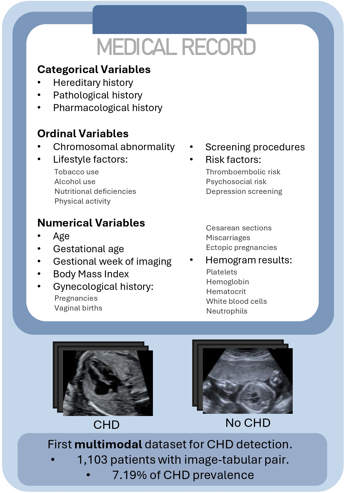
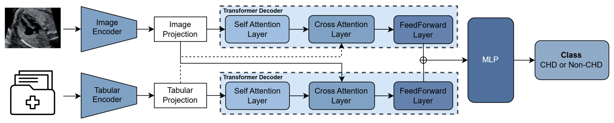

#  CARDIUM: Congenital Anomaly Recognition with Diagnostic Images and Unified Medical Records

[](https://openreview.net/forum?id=MDHl5LCcka)
[](./LICENSE)
[](./DATDATASET_LICENSE)
[](https://bcv-uniandes.github.io/CardiumPage/)

---

## 📰 News
- **[October 2025]** 🚀 *Coming soon!* We will be releasing the **tabular data**, **imaging data**, associated with the CARDIUM project. Stay tuned to this repository or check our [project website](https://bcv-uniandes.github.io/CardiumPage/) for updates.
---


This repository contains the code implementation of **CARDIUM: Congenital Anomaly Recognition with Diagnostic Images and Unified Medical Records**, which was presented at the *Third Workshop on Computer Vision for Automated Medical Diagnosis* at ICCV 2025.

Prenatal diagnosis of Congenital Heart Diseases (CHDs) holds great potential for Artificial Intelligence (AI)-driven solutions. However, collecting high-quality diagnostic data remains difficult due to the rarity of these conditions, resulting in imbalanced and low-quality datasets that hinder model performance. Moreover, no public efforts have been made to integrate multiple sources of information, such as imaging and clinical data, further limiting the ability of AI models to support and enhance clinical decision-making. To overcome these challenges, we introduce the **C**ongenital **A**nomaly **R**ecognition with **D**iagnostic **I**mages and **U**nified **M**edical records (CARDIUM) dataset, the first publicly available multimodal dataset consolidating fetal ultrasound and echocardiographic images along with maternal clinical records for prenatal CHD detection. Furthermore, we propose a robust multimodal transformer architecture that incorporates a cross-attention mechanism to fuse feature representations from image and tabular data, improving CHD detection by 11% and 50% over image and tabular single-modality approaches, respectively, and achieving an F1-score of 79.8 ± 4.8% in the CARDIUM dataset. We will publicly release our dataset and code to encourage further research on this unexplored field. 

<div style="text-align: center;">
    
    <p><em>Fig. 1. Overview of the CARDIUM dataset.</em></p>
</div>



<p><em>Fig. 2. Overview of the CARDIUM model.</em></p> 


## Table of Contents
* [Overview](#overview)
* [CARDIUM dataset and pretrained models](#cardium-dataset-and-pretrained-models)
* [Setup](#setup)
* [Usage](#usage)
* [Citation](#citation)

## Overview
This repository provides both the multimodal dataset and the model implementation. Users can download the data and replicate the results from Sections 5.1, and 5.2 of our paper.

## CARDIUM Dataset and Pretrained Models

### Image and Tabular Data

The CARDIUM dataset includes:

- **6558 anonymized images**, with 16.3% corresponding to positive CHD patients and 83.7% to negative patients, structured across 3 folds for training and testing.
- **Clinical tabular data** in both raw and preprocessed formats:
  - `delfos_clinical_data_wnm_translated_final_cleaned.json` – raw data for tabular encoder training.
  - `delfos_clinical_data_woe_wnm_standarized_f_normalized.json` – preprocessed data used for the multimodal model.

All image and tabular data files can be accessed through the following [download link](#), **exclusively for academic and research purposes**. Access is subject to verification.

> **Note:** After downloading, the image data will be provided as a `.tar` file. Please extract it inside the `data/` directory, maintaining the folder structure shown below. Ensure tabular data JSONs are also downloaded inside this directory.
>  
> Example (Linux/macOS):  
> ```bash
> tar -xvf cardium_images_anon.tar -C data/
> ```


Upon download, the dataset will follow this structure:

```text
data/
├── cardium_images_anon/
│   ├── fold_1/
│   │   ├── train/
│   │   │   ├── CHD/
│   │   │   └── Non_CHD/
│   │   └── test/
│   │       ├── CHD/
│   │       └── Non_CHD/
│   ├── fold_2/
│   │   ├── train/
│   │   └── test/
│   └── fold_3/
│       ├── train/
│       └── test/
└── tabular_data/
    ├── delfos_clinical_data_wnm_translated_final_cleaned.json
    └── delfos_clinical_data_woe_wnm_standarized_f_normalized.json
```

### Pretrained Models

Pretrained models are available for:

- The **image-based classifier** (trained on the CARDIUM image dataset).
- The **tabular-based classifier** (trained on the CARDIUM tabular dataset).
- The **multimodal model** combining tabular and image features.

These models can be downloaded from the same [link](#) as the dataset. Access is granted **only to individuals or institutions with academic or research purposes**, and requests are subject to verification.


## Setup
1. Create a virtual environment:
```bash
conda env create -f CARDIUM.yml
```
2. Install dependencies:
```bash
pip install -r requirements.txt
```

## Usage
### Training from draft 
1. Train the tabular encoder:
```bash 
python tabular_script/main_tab.py --num_epochs 400 --batch_size 32 --lr 0.00000050169647031011 --weight_decay 1e-3 --loss_factor 0.7 --sampling False
```
After training the tabular encoder, the repository structure will include the following additions:

```text
.
├── data/
│   └── tabular_data/
│       ├── delfos_clinical_data_wnm_translated_final_cleaned.json
│       │   (raw file for tabular encoder training)
│       ├── delfos_clinical_data_woe_wnm_standarized_f_normalized.json
│       │   (preprocessed file for multimodal model)
│       └── output_folds_final/
│           (contains 6 JSONs for training and testing across three folds)

└── tabular_script/
    └── tabular_checkpoints/
        └── run_name/
            ├── fold0_best_model.pth
            ├── fold1_best_model.pth
            └── fold2_best_model.pth
            
```

2. Train the image encoder:
```bash 
python img_script/main_img.py --lr 1e-6 --batch_size 8 --loss_factor 2
```
After training the image encoder, the checkpoints will be stored here: 

```text
.
└── img_script/
    └── image_checkpoints/
        └── run_name/
            ├── fold0_best_model.pth
            ├── fold1_best_model.pth
            └── fold2_best_model.pth
```

3. Train the multimodal model:

After training the multimodal model, the checkpoints will be stored here
```bash 
python multimodal_script/main_multimodal.py
```
After training the multimodal model, the checkpoints will be stored here:

```text
.
└── multimodal_script/
    └── multimodal_checkpoints/
        └── run_name/
            ├── fold0_best_model.pth
            ├── fold1_best_model.pth
            └── fold2_best_model.pth
```

### Inference
#### Tabular Encoder
```bash 
python tabular_script/inference_tab.py --num_epochs 400 --batch_size 32 --lr 0.00000050169647031011 --weight_decay 1e-3 --loss_factor 0.7 --sampling False --tab_checkpoint {tabular_checkpoint_route} 
```

#### Image Encoder
```bash 
python img_script/inference_img.py --lr 1e-6 --batch_size 8 --loss_factor 2 --img_checkpoint {image_checkpoint_route}
```

#### Multimodal Model
```bash 
python multimodal_script/inference_multimodal.py --multimodal_checkpoint {multimodal_checkpoint_route}  
```


### Trimester Performance
For trimestral CHD detection results (Section 5.2):
1. Save the divided dataset:
```bash 
 python trimester_results/create_trimester_dataset.py
```
Data will be stored here:
```text
.
└── data/
    └── trimester_images/
        ├── first_trimester/
        ├── second_trimester/
        └── third_trimester/
```
2. Make inference from multimodal model in specific trimester data:
```bash 
python multimodal_script/inference_multimodal.py --image_folder_path dataset/trimester_images --trimester first
```
For second and third trimester, put second and third in --trimester parameter.

## License
- The **code** is released under the Apache 2.0 License (see [License](./LICENSE)).  
- The **CARDIUM dataset** is released under the CC BY-NC 4.0 License (see [Dataset_License](./DATASET_LICENSE)).  

## Citation
```bash 
@inproceedings{
vega2025cardium,
title={{CARDIUM}: Congenital Anomaly Recognition with Diagnostic Images and Unified Medical records},
author={Daniela Vega and Hannah Ceballos and Javier Santiago Vera Rincon and Santiago Rodriguez and Alejandra Perez and Angela Castillo and Maria Escobar and Dario Londo{\~n}o and Luis Andres Sarmiento and Camila Irene Castro and Nadiezhda Rodriguez and Juan Carlos Brice{\~n}o and Pablo Arbelaez},
booktitle={Third Workshop on Computer Vision for Automated Medical Diagnosis},
year={2025},
url={https://openreview.net/forum?id=MDHl5LCcka}
}
```